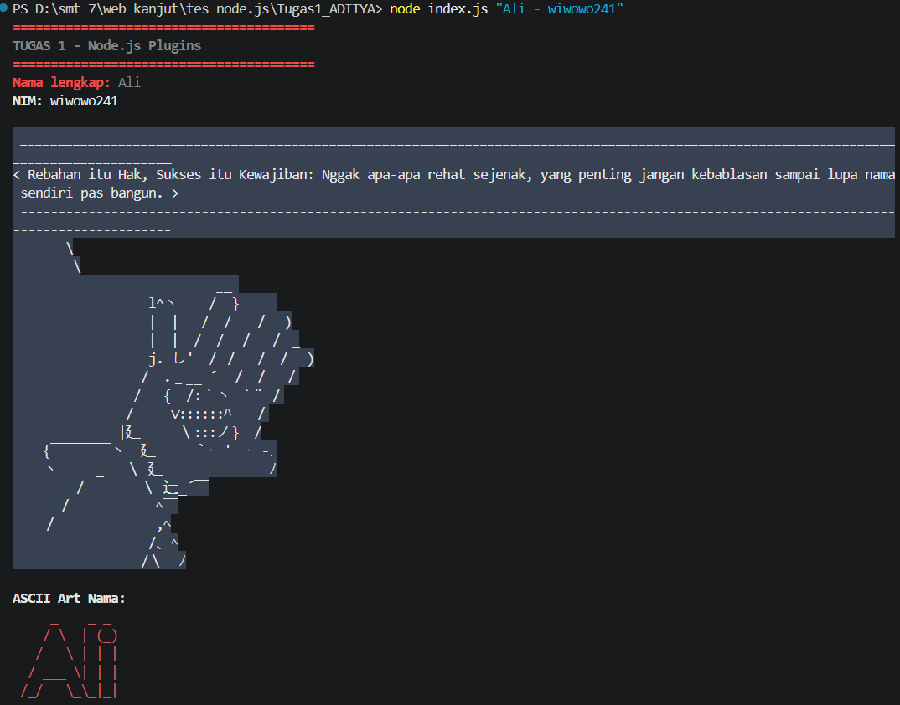
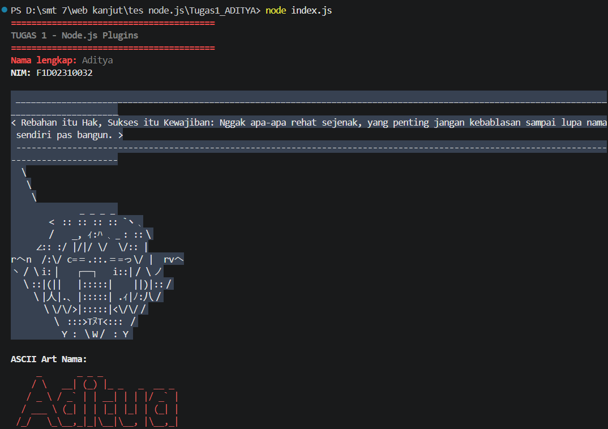
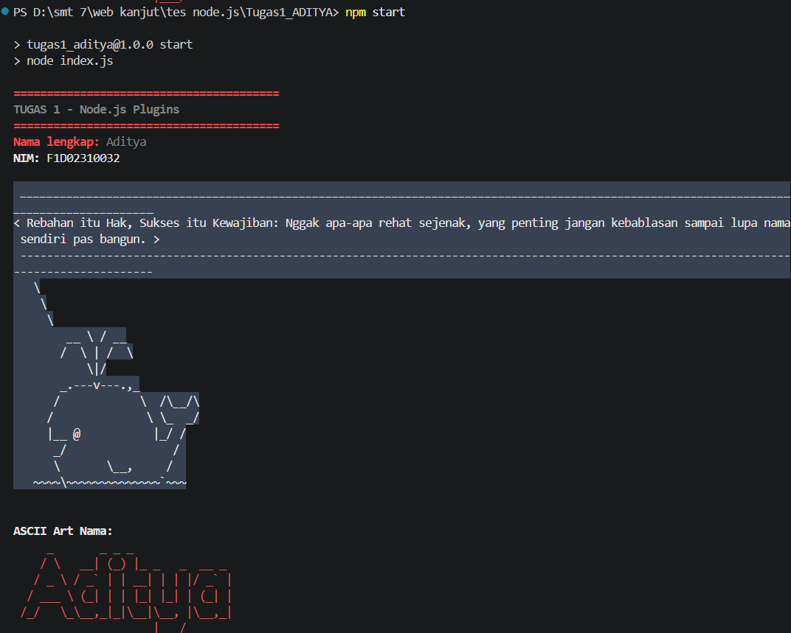

# T1 - Node.js Plugins

Project ini dibuat untuk memenuhi tugas Node.js Plugins dengan menggunakan `chalk`, `cowsay`, dan `figlet`. Program menampilkan identitas mahasiswa, pesan motivasi, serta nama dalam bentuk ASCII art.

## Prasyarat

Pastikan aplikasi berikut sudah terpasang:

- [Node.js](https://nodejs.org/) versi LTS atau lebih baru.
- npm, yang biasanya sudah termasuk dalam instalasi Node.js.

Untuk memeriksa instalasi, jalankan perintah berikut di terminal:

```bash
node --version
npm --version
```

## Instalasi

1. Buka terminal atau Command Prompt.
2. Masuk ke folder project:

3. Install seluruh dependency yang tercantum di `package.json`:

   ```bash
   npm install
   ```

   Perintah ini akan mengunduh dan memasang package `chalk`, `cowsay`, dan `figlet` ke dalam folder `node_modules`.

## Menjalankan Project

Pastikan terminal masih berada di folder project, kemudian pilih salah satu cara berikut.

### Cara 1: Menjalankan file secara langsung

```bash
node index.js
```

Perintah tersebut menjalankan program dengan identitas default:

- Nama: `Aditya`
- NIM: `F1D02310032`

### Cara 2: Menggunakan script npm

```bash
npm start
```

Script `start` menjalankan perintah `node index.js` melalui konfigurasi di `package.json`.

### Menggunakan nama dan NIM sendiri

Nama dan NIM dapat dikirim sebagai satu argumen dengan format `Nama - NIM`:

```bash
node index.js "Aditya - F1D02310032"
```

Contoh menggunakan data lain:

```bash
node index.js "Ali - wiwowo241"
```

## Fitur Program

- `chalk` memberi warna dan format pada teks identitas serta ASCII art.
- `cowsay` menampilkan pesan motivasi di terminal.
- `figlet` mengubah nama menjadi ASCII art.
- `process.argv` menerima nama dan NIM dari input terminal.

Pesan motivasi yang digunakan:

> Rebahan itu Hak, Sukses itu Kewajiban: Nggak apa-apa rehat sejenak, yang penting jangan kebablasan sampai lupa nama sendiri pas bangun.

## Screenshot

Screenshot hasil instalasi dan eksekusi project tersedia di folder `screenshot`:

### Input Argumen



### Menjalankan dengan Node.js



### Menjalankan dengan npm start


